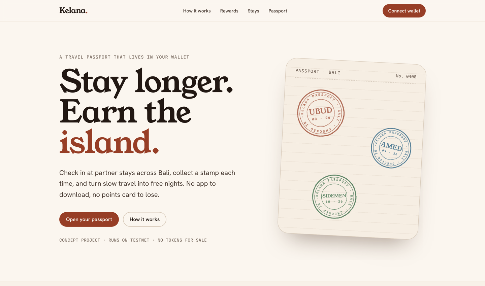
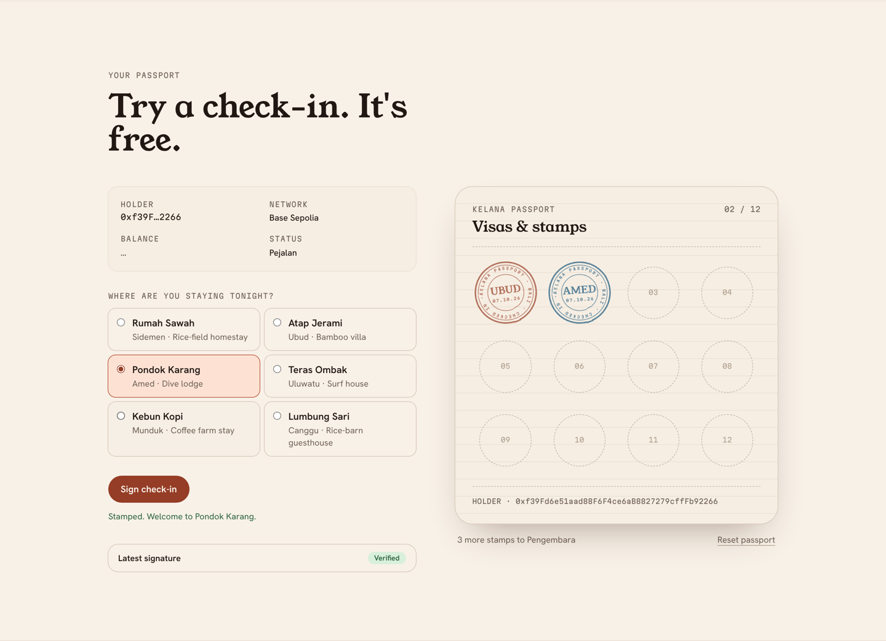
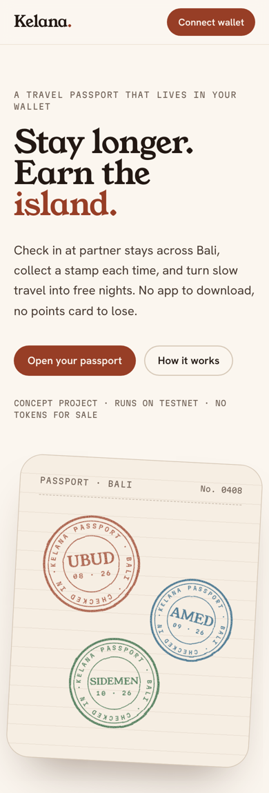

# Kelana

**A travel passport that lives in your wallet.** A concept loyalty program for slow travel in Bali: check in at a stay by signing a message with your wallet, collect a stamp, and climb toward free nights.

Designed and built by [Iman Rafief](https://github.com/hhhelpstudio).

**[Live demo → kelana-orcin.vercel.app](https://kelana-orcin.vercel.app/)**



> **Concept project.** The stays are fictional, it runs on testnets, and there are no tokens. Checking in is a free signature, never a transaction.

---

## The idea

Hotel loyalty programs live in apps you forget to open and points that quietly expire. Kelana moves the whole thing into the wallet a traveler already carries:

1. **Book a partner stay** the way you normally would.
2. **Check in with your wallet** by signing one message at the door. No gas, two seconds.
3. **Collect stamps and climb the ladder:** *Pejalan* (walker) → *Pengembara* (wanderer) → *Kelana* (one who roams).

## What's interesting under the hood

**EIP-712 check-ins instead of transactions.** A check-in is a typed-data signature over `{ guest, stayId, stay, issuedAt, nonce }`, bound to a named domain and chain ID. The wallet shows the guest every field before they approve, it can't move funds, and it costs nothing. A random 32-byte nonce means no two check-ins ever share a signature.

**Verify before stamping, fast path first.** Every signature is verified before a stamp is added. The signer is recovered locally first (instant, works offline). Only if that doesn't match does it fall back to an onchain check, which is what smart-contract wallets need (ERC-1271 / ERC-6492).

**Real wallet discovery.** Wallets are found through EIP-6963, so every installed wallet appears by its own name and icon. There's a fallback for legacy wallets that only inject `window.ethereum`, and a helpful empty state when there's no wallet at all.

**No wallet-modal library.** The picker and account menu are built on the native Popover API (light-dismiss, Escape and top-layer stacking for free), positioned with CSS anchor positioning, and fall back gracefully in browsers without it.

**Hydration-safe wallet state.** Wallets announce themselves and saved connections restore *before* React hydrates. A small `useHydrated` hook keeps the server and client markup identical, so there are no hydration errors when a returning user auto-reconnects.

**Stamps that survive a reload.** Stamps are stored per address in `localStorage` through a `useSyncExternalStore` store, so they stay in sync across tabs. Each stamp keeps its signature, so it can be re-verified any time.



## Design

The brief I set myself was "sun-bleached, slow, quietly confident": a deliberate break from neon-on-black crypto sites.

- **Palette:** warm sand neutrals and a single terracotta accent (Balinese roof tiles), all in OKLCH. Every text pairing passes WCAG AA.
- **Type:** Young Serif for display, Hanken Grotesk for body, and Martian Mono only where text really is data (addresses, hashes, stamp lettering). All self-hosted.
- **Signature element:** SVG rubber stamps with curved ring text and an ink-texture filter. The filter and ring path are defined once and shared by every stamp on the page.
- **Motion:** a staggered entrance and a "press" animation when a stamp lands. All of it respects `prefers-reduced-motion`.



## Stack

| | |
|---|---|
| Framework | Next.js 16 (App Router, Turbopack, Cache Components), React 19 |
| Language | TypeScript (strict) |
| Styling | Tailwind CSS v4 with OKLCH design tokens |
| Web3 | wagmi v3, viem, TanStack Query |
| Networks | Base Sepolia, Sepolia (mainnet only for ENS names) |

## Run it locally

```bash
npm install
npm run dev        # http://localhost:3000
```

Other scripts: `npm run build`, `npm run lint`, `npm run typecheck`.

You'll need a browser wallet (Rabby, MetaMask or similar) to check in. No testnet ETH is required, since signing is free.

## Project structure

```
src/
├── app/
│   ├── layout.tsx            fonts, metadata, providers
│   ├── page.tsx              composes the sections
│   ├── providers.tsx         wagmi + TanStack Query
│   └── globals.css           design tokens, base styles, buttons
├── components/
│   ├── Stamp.tsx             SVG rubber stamp + shared defs
│   ├── passport/             the interactive check-in app
│   ├── sections/             landing page sections
│   └── wallet/               connect button, account menu, wallet picker
├── lib/
│   ├── wagmi.ts              chains, connectors, transports
│   ├── checkin.ts            EIP-712 domain, types, message builder
│   ├── passport-store.ts     per-address stamp storage
│   ├── stays.ts              stays and reward tiers
│   ├── use-hydrated.ts       hydration guard for wallet state
│   └── format.ts             address and balance formatting
└── fonts/                    self-hosted OFL fonts
```

## If this were real

- Anchor stamps onchain: an attestation (e.g. EAS) or a soulbound token minted by the stay, so a guest can't self-issue stamps.
- Have the *stay* co-sign check-ins, proving presence rather than just intent.
- Add WalletConnect for mobile wallets.
- Use a dedicated RPC provider instead of public endpoints.

## License

Code: MIT. Fonts: SIL Open Font License 1.1 (see `src/fonts`).
